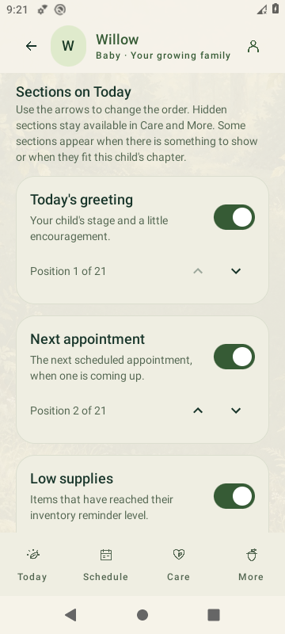
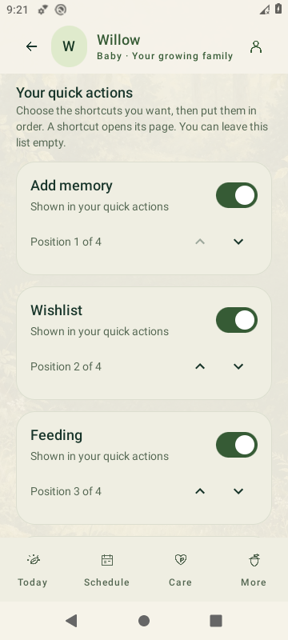
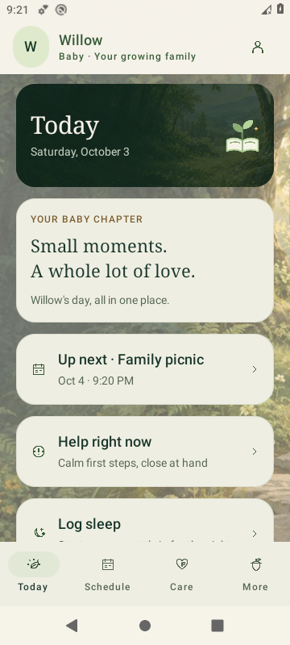
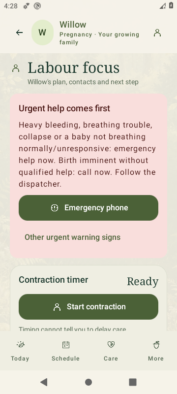
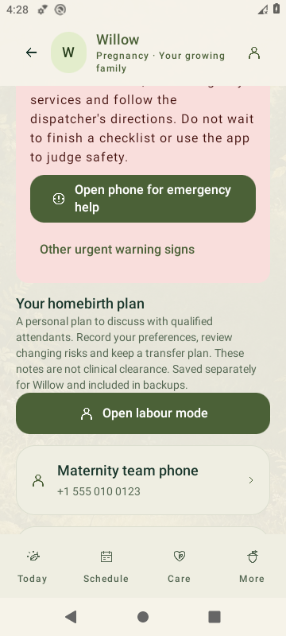
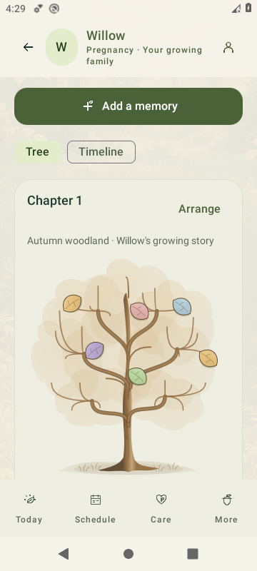
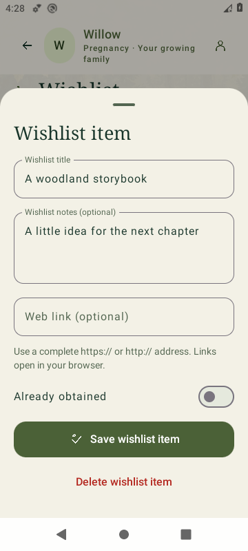
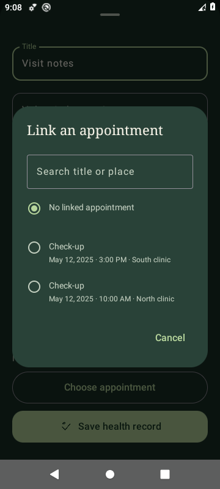

  

  <strong>Android 8.0+ · Version 3.7.0 · Evaluation pre-release</strong> 
  <a href="https://sproutbook-woodland.nothatch.chatgpt.site/downloads/SproutBook-3.7.0-debug.apk">Direct APK download</a> ·
  <a href="https://github.com/nothatcher-creator/Sproutbook/releases/tag/v3.7.0">Release notes</a> ·
  <a href="docs/INSTALL.md">Installation guide</a>

  
  
  

## A calmer place for your growing family

SproutBook brings the little details of parenting together: the last feed, the next appointment, a new tooth, a favourite meal, and a memory you want to keep. Its native Android interface uses soft woodland paintings, forest greens, warm cream, and simple controls built for busy hands.

From pregnancy through the teen years, each child has their own profile and records. Four main tabs keep everyday care close: **Today, Schedule, Care, and More**.

Make Today fit your family: choose the sections, put shortcuts in your preferred order, and pick a woodland scene or your own background photo for each child.

## Four familiar places

<table>
  <tr>
    <td width="50%"> <strong>Today · Your day at a glance</strong> Your chosen sections and shortcuts, stage-aware care, upcoming appointments, low supplies, and your child's memory tree.</td>
    <td width="50%"> <strong>Schedule · Room for what matters</strong> One connected calendar for appointments, birthdays, due dates, and family plans. Hold a day to start an appointment.</td>
  </tr>
  <tr>
    <td> <strong>Care · The everyday essentials</strong> Feeding, sleep, sounds, solids, teeth, development, pregnancy tools, and practical parent guidance.</td>
    <td> <strong>More · Your family, connected</strong> Profiles, the Home screen organizer, supplies, emergency information, caregiver mode, settings, backups, and diagnostics.</td>
  </tr>
</table>

*These are the original tab illustrations bundled in the 3.4 woodland update.*

## Little tools that make a difference

| Caring for today | Keeping the bigger picture |
| --- | --- |
| **Feeding hub** — bottles, breastfeeding, pumping, prepared bottles, and a formula planning estimate. | **Memory tree** — seasonal woodland styles, leaves for moments, branch placement, chapters, and a timeline for each child. |
| **Sleep + sound** — sleep sessions and eight native sounds, with pause, resume, volume, and timers. | **Schedule** — appointments, annual birthdays, due dates, and optional reminders. |
| **Solids + meals** — foods tried, favourites, possible reactions, allergens, and weekly meal planning. | **Development** — visual baby teeth, stage-specific milestones, and recorded growth. |
| **Parent support** — searchable Mom/Dad advice, sourced birth guidance, and three calm first steps in Help Right Now. | **Pregnancy** — kick sessions, contraction timing, a homebirth plan, Labour focus, and personal preparation lists. |
| **Everyday routines** — diaper and potty logs, milk freezer containers, responsibilities, and shopping. | **Family essentials** — a wishlist and woodland appearance for each child, supplies, health journal, an offline emergency card, and read-only grandparent mode. |

### A closer look at the native app

  
  
  

*Native 3.7 organizer screens use sample family data. The 3.6 screens below show the retained birth-planning and family tools.*

  
  
  
  

*Native 3.6 emulator screens with sample family data. Earlier screens below show the preserved woodland interface.*

  
  
  

*Actual 3.5 emulator screenshots, using sample family data.*

*The 3.5.1 health picker, captured on the Android emulator with sample visits.*

## Install in a few steps

1. Tap **Download SproutBook** at the top of this page.
2. Open the APK on your Android phone. If prompted, allow installation from the browser or Files app you used.
3. Install, open SproutBook, and add your child's profile.

For updates, keep your existing app installed and use the same signing identity. Export and keep a backup before updating. See the [installation guide](docs/INSTALL.md) for details and the [SHA-256 checksums](https://github.com/nothatcher-creator/Sproutbook/releases/download/v3.7.0/SHA256SUMS-3.7.0.txt) to verify the download.

## A personal Today · 3.7.0

Open **More → Home screen organizer** to arrange your child's Today page. Move any of its **21 content sections** up or down and show or hide each one. Care cards still appear when they fit the child's stage or have something to show. The app header and four navigation tabs stay in their familiar places.

Choose from **23 quick shortcuts**, put them in your preferred order, or leave the shortcut list empty. **Add memory** opens a new memory editor directly. Choose **Woodland, Morning, Meadow, Evening, or Plain**, or select a picture through Android's photo picker. SproutBook copies that picture into private app storage so the saved background works offline.

**Preview** lets you inspect the layout with feature actions disabled. **Save layout** applies your choices; **Cancel** keeps the saved layout. **Restore defaults** asks for confirmation and prepares a draft that still waits for Save. Each child keeps their own choices, and Grandparent mode stays read-only. Hiding a Today section leaves its records available through the other app pages.

3.7.0 uses an additive Room 12→13 migration and backup format 5 for layouts and background photos. It imports older native formats 1–4; 3.6.0 and earlier cannot restore format-5 exports. It retains the existing evaluation signing identity. Verification passed 126 unit tests and 36 unique native emulator checks, with normal/150% screenshots and an actual update preserving old fixture records and settings. Physical-device, spoken TalkBack and hardware performance checks remain open. Artifact freezing and website/GitHub publication are pending in the [release notes](docs/RELEASE-3.7.0.md) and [native QA](android/docs/QA-3.7.md).

## Birth planning and a woodland of their own · 3.6.0

**3.6.0** adds readable offline guidance for attended homebirth, freebirth, transfer planning, and after-birth care, with labelled NHS, NICE, and CDC sources. Editable lists let you keep your own notes, add items, and mark preparations complete. The [source review](android/docs/BIRTH-SOURCES-3.6.md) explains the evidence and local-care limits.

Your child's **homebirth plan** keeps care contacts, birth address, support people, preferences, transfer arrangements, aftercare, and priorities together. **Labour focus** brings the saved plan, maternity contact, urgent-help guidance, contraction controls, and recent contractions into one native view. Dial buttons open the phone app for review. The journal and timer do not diagnose labour or decide when it is safe to delay care.

Each child now has a **wishlist** for gifts, books, experiences, or other ideas, with notes, optional web links, and Wanted/Obtained filters. Choose a **Forest, Moss, Amber, or Sky accent** and a **Summer, Autumn, or Night tree** in their profile. The Memory Tree has richer native woodland scenery and shaded leaves, while keeping leaf placement, chapters, and the timeline.

The 3.6.0 evaluation release used an additive Room 11→12 migration and backup format 4. Its [release notes](docs/RELEASE-3.6.0.md) and [native QA](android/docs/QA-3.6.md) record 111 passing unit tests, 32 unique passing native checks, and normal/150% screen verification. These are historical 3.6 results. Physical-device performance, spoken TalkBack, Android 17 behavior, minified runtime, and production signing remain open.

## Care notes, connected to the right visit · 3.5.1

**3.5.1** adds a searchable native appointment picker to the health journal. Date, time, and place distinguish repeat check-ups; older visits stay reachable. Cancel keeps your draft link, and clearing a link leaves the appointment intact. Editing notes keeps the original recorded time, including daylight-saving clock changes.

The 3.5 woodland motion pack, painted scenes, custom icons, forest greens, and warm cream remain in both themes. Motion respects Reduce motion, Android's animation setting, battery saver, lifecycle, and visibility. Reduce motion stays enabled by default for new installs; artwork works offline.

The earlier 3.5.1 release kept Room schema 11 and backup format 3 unchanged. Its build, unit, emulator, update-preservation, and rendered-browser results remain in the [3.5.1 release notes](docs/RELEASE-3.5.1.md) and [3.5.1 native QA](android/docs/QA-3.5.1.md).

## Wander through the showcase

[**Open the woodland website**](https://sproutbook-woodland.nothatch.chatgpt.site)

Travel from sunrise above the canopy to a memory oak, woodland noticeboard, feeding picnic, quiet nursery, and growing sapling. Layered scenery, animals, leaves, and native app screens follow your scrolling in both directions. The journey ends at a nighttime clearing with the Android download. Reduced motion and motion-off keep a complete static experience. Try the preserved sample memory, feeding, and tooth demos, then suggest a feature through the pre-filled GitHub request form. [Read the website verification](website/QA-JOURNEY.md).

The APK download stays at the top of both the website and this README. Website demos use temporary sample data and never connect to your family's app records.

## Your family's records stay close

Core records and each child's Today choices are stored locally using Room and DataStore. Chosen background photos are copied to private app storage. The app has no account requirement, cloud sync, or Internet permission. Optional reminders use Android notifications; sound uses native Android audio. Backups can include photos and are exported through the file picker, so keep them private.

[Read the data and privacy notes](docs/PRIVACY.md). Grandparent mode helps prevent accidental edits; it is not a password-protected account or security boundary.

Parenting and health guidance is general education. For an emergency, contact emergency services. SproutBook does not diagnose conditions or replace your family's care team.

## Follow along

[Showcase website](https://sproutbook-woodland.nothatch.chatgpt.site) · [Releases](https://github.com/nothatcher-creator/Sproutbook/releases) · [Report a problem or suggest an idea](https://github.com/nothatcher-creator/Sproutbook/issues) · [Figma design reference](https://www.figma.com/design/SjQl6MaLL4e5YqK10grN2c)

The [3.7.0 source download](https://github.com/nothatcher-creator/Sproutbook/releases/download/v3.7.0/SproutBook-3.7.0-source.zip) contains the complete Kotlin source project, editable artwork, motion assets, and QA evidence. The recovered native project is now in [`android/`](android/); showcase source stays in [`website/`](website/). Build instructions and the persistent [continuation checkpoint](docs/CONTINUATION.md) let another session continue from verified work. The Figma reference includes the visual system and earlier artwork variants. Cloud sharing, partner accounts, widgets, and iOS are future work.

<em>A small place to remember, plan, and grow together.</em>

